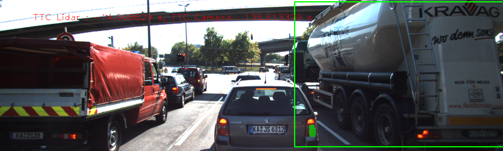
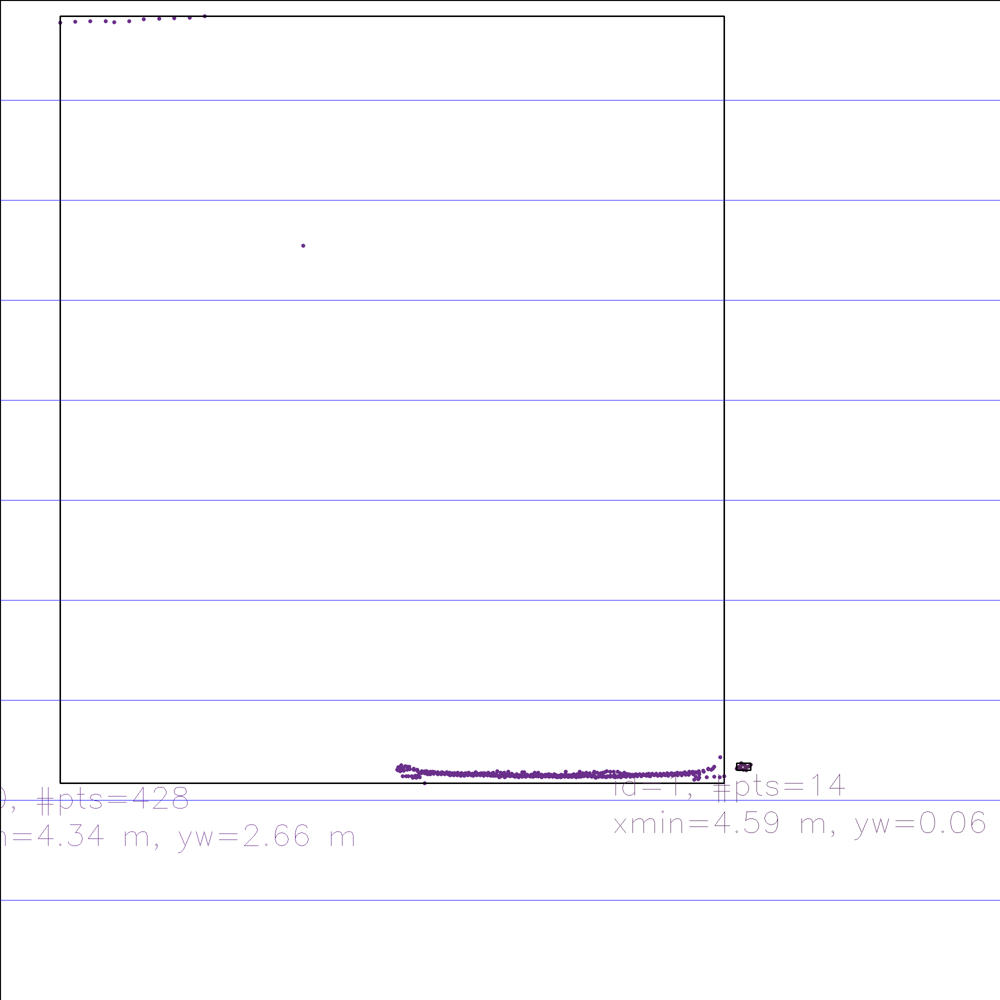
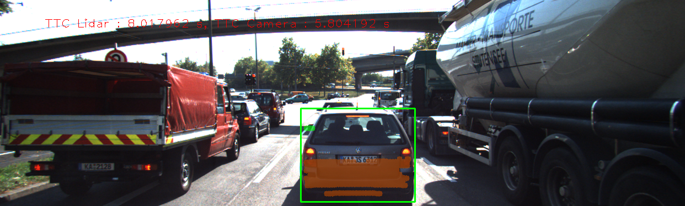
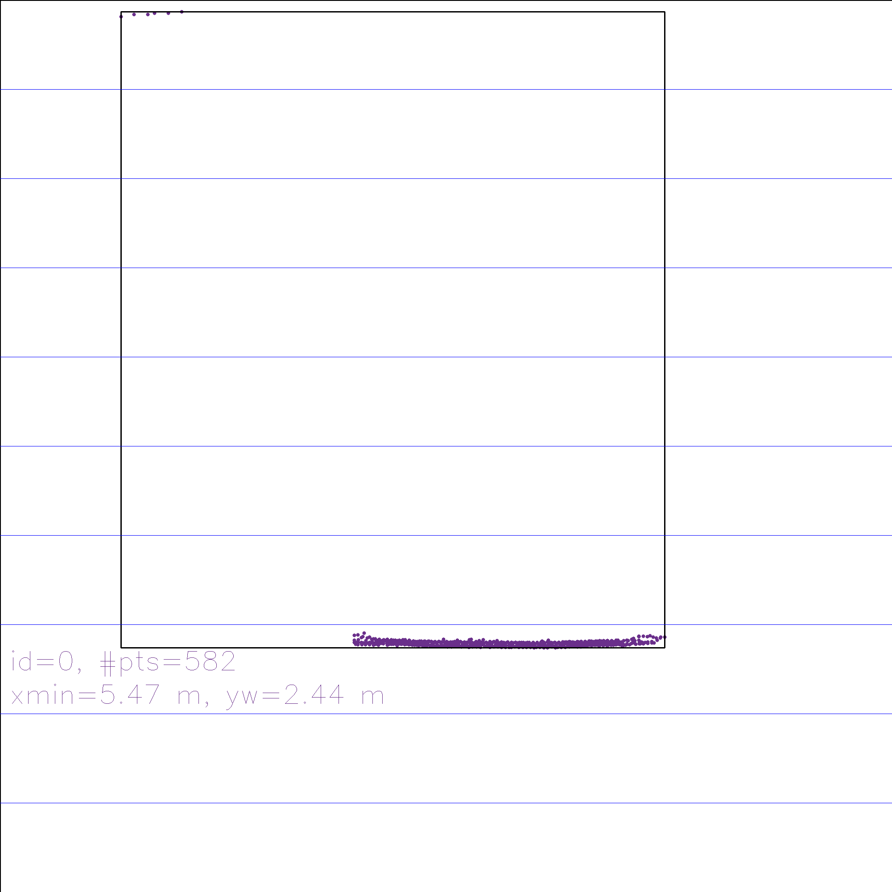

# SFND 3D Object Tracking

Welcome to the final project of the camera course. By completing all the lessons, you now have a solid understanding of keypoint detectors, descriptors, and methods to match them between successive images. Also, you know how to detect objects in an image using the YOLO deep-learning framework. And finally, you know how to associate regions in a camera image with Lidar points in 3D space. Let's take a look at our program schematic to see what we already have accomplished and what's still missing.


In this final project, you will implement the missing parts in the schematic. To do this, you will complete four major tasks: 
1. First, you will develop a way to match 3D objects over time by using keypoint correspondences. 
2. Second, you will compute the TTC based on Lidar measurements. 
3. You will then proceed to do the same using the camera, which requires to first associate keypoint matches to regions of interest and then to compute the TTC based on those matches. 
4. And lastly, you will conduct various tests with the framework. Your goal is to identify the most suitable detector/descriptor combination for TTC estimation and also to search for problems that can lead to faulty measurements by the camera or Lidar sensor. In the last course of this Nanodegree, you will learn about the Kalman filter, which is a great way to combine the two independent TTC measurements into an improved version which is much more reliable than a single sensor alone can be. But before we think about such things, let us focus on your final project in the camera course. 

## Dependencies for Running Locally
* cmake >= 2.8
  * All OSes: [click here for installation instructions](https://cmake.org/install/)
* make >= 4.1 (Linux, Mac), 3.81 (Windows)
  * Linux: make is installed by default on most Linux distros
  * Mac: [install Xcode command line tools to get make](https://developer.apple.com/xcode/features/)
  * Windows: [Click here for installation instructions](http://gnuwin32.sourceforge.net/packages/make.htm)
* Git LFS
  * Weight files are handled using [LFS](https://git-lfs.github.com/)
* OpenCV >= 4.1
  * This must be compiled from source using the `-D OPENCV_ENABLE_NONFREE=ON` cmake flag for testing the SIFT and SURF detectors.
  * The OpenCV 4.1.0 source code can be found [here](https://github.com/opencv/opencv/tree/4.1.0)
* gcc/g++ >= 5.4
  * Linux: gcc / g++ is installed by default on most Linux distros
  * Mac: same deal as make - [install Xcode command line tools](https://developer.apple.com/xcode/features/)
  * Windows: recommend using [MinGW](http://www.mingw.org/)

## Basic Build Instructions

1. Clone this repo.
2. Make a build directory in the top level project directory: `mkdir build && cd build`
3. Compile: `cmake .. && make`
4. Run it: `./3D_object_tracking`.


## Solutions

#### FP.1 Match 3D Objects
###### Implement the method "matchBoundingBoxes", which takes as input both the previous and the current data frames and provides as output the ids of the matched regions of interest (i.e. the boxID property). Matches must be the ones with the highest number of keypoint correspondences.

```c++
void matchBoundingBoxes(std::vector<cv::DMatch> &matches, std::map<int, int> &bbBestMatches, DataFrame &prevFrame,
                        DataFrame &currFrame) {
    // keep a record of matched boxIds between two consecutive frames
    std::multimap<int, int> prevCurrIds;
    for (auto match : matches) {
        cv::KeyPoint kpt = prevFrame.keypoints[match.queryIdx];
        int prevBoxId = -1;
        int currBoxId = -1;
        for (auto &bb : prevFrame.boundingBoxes) if (bb.roi.contains(kpt.pt)) prevBoxId = bb.boxID;
        for (auto &bb : currFrame.boundingBoxes) if (bb.roi.contains(kpt.pt)) currBoxId = bb.boxID;
        if (prevBoxId != -1 && currBoxId != -1) prevCurrIds.emplace(prevBoxId, currBoxId);
    }
    // One matched keypoint from previous frame may be enclosed by zero, one or more bounding boxes in currentFrame. So
    // iterate through all the boxIds in prevFrames. For each prev boxId a range of corresponding boxIds in currFrame
    // has been already stored in commonBoxIds. to get iterator to that range use equal range function built in to
    // multimap. within that range count most frequent curr BoxIds for prevBoxId using a map.
    for (auto const &bb : prevFrame.boundingBoxes) {
        auto range = prevCurrIds.equal_range(bb.boxID);
        std::map<int, int> frequentCurrBoxIDs;
        for (auto it = range.first; it != range.second; it++) {
            auto foundInFrequentBoxIds = frequentCurrBoxIDs.find(
                    it->second); // it contains pair (prevBoxId (first),currBoxId (second))
            if (foundInFrequentBoxIds != frequentCurrBoxIDs.end()) foundInFrequentBoxIds->second++;
            else frequentCurrBoxIDs.emplace(std::make_pair(it->second, 1));
        }
        int maxCurrBoxCount = 0;
        int mostFrequentCurrBoxID = -1;
        for (auto it = frequentCurrBoxIDs.begin(); it != frequentCurrBoxIDs.end(); it++) {
            if (maxCurrBoxCount < it->second) {
                mostFrequentCurrBoxID = it->first;
                maxCurrBoxCount = it->second;
            }
        }
        if (mostFrequentCurrBoxID != -1) bbBestMatches.emplace(std::make_pair(bb.boxID, mostFrequentCurrBoxID));
    }
}

```

#### FP.2 Compute Lidar-based TTC

###### Compute the time-to-collision in second for all matched 3D objects using only Lidar measurements from the matched bounding boxes between current and previous frame. 


```c++
void computeTTCLidar(std::vector<LidarPoint> &lidarPointsPrev,
                     std::vector<LidarPoint> &lidarPointsCurr, double frameRate, double &TTC) {
    vector<double> prevXs, currXs;
    for (auto p : lidarPointsPrev) prevXs.push_back(p.x);
    for (auto p : lidarPointsCurr) currXs.push_back(p.x);
    TTC = (prevXs.size() && currXs.size()) ? median(currXs) / (median(prevXs) - median(currXs)) / frameRate : NAN;
}
```

#### FP.3 Associate Keypoint Correspondences with Bounding Boxes
###### Prepare the TTC computation based on camera measurements by associating keypoint correspondences to the bounding boxes which enclose them. All matches which satisfy this condition must be added to a vector in the respective bounding box.

```c++
// associate a given bounding box with the keypoints it contains
void clusterKptMatchesWithROI(BoundingBox &boundingBox, std::vector<cv::KeyPoint> &kptsPrev,
                              std::vector<cv::KeyPoint> &kptsCurr, std::vector<cv::DMatch> &kptMatches) {

    std::vector<double> distances;
    std::vector<cv::DMatch> kptMatchesInBoxRoi;
    // for each keypoint in given matching keypoints checking
    // whether the particular keypoint is within the region of interest of a given bounding box.
    for (auto kptMatch: kptMatches) {
        cv::Point prevP = kptsPrev[kptMatch.queryIdx].pt;
        cv::Point currP = kptsCurr[kptMatch.trainIdx].pt;
        if (boundingBox.roi.contains(currP)) {
            distances.push_back(cv::norm(currP - prevP));
            kptMatchesInBoxRoi.push_back(kptMatch);
        }
    }

    // compute a robust mean of all the euclidean distances between keypoint matches
    // and then remove those that are too far away from the mean.
    double mu = median(distances);
    auto mnmx = std::minmax_element(distances.begin(), distances.end());
    double range = mnmx.second - mnmx.first;
    for (int i = 0; i < distances.size(); ++i)
        if (fabs(distances[i] - mu) < range * .8)
            boundingBox.kptMatches.push_back(kptMatchesInBoxRoi[i]);
}

```


#### FP.4 Compute Camera-based TTC
###### Compute the time-to-collision in second for all matched 3D objects using only keypoint correspondences from the matched bounding boxes between current and previous frame.
 ```c++
// Compute time-to-collision (TTC) based on keypoint correspondences in successive images
void computeTTCCamera(std::vector<cv::KeyPoint> &kptsPrev, std::vector<cv::KeyPoint> &kptsCurr,
                      std::vector<cv::DMatch> kptMatches, double frameRate, double &TTC, cv::Mat *visImg) {
    // compute distance ratios between all matched keypoints
    if(kptMatches.size()==0) return;
    vector<double> distRatios; // stores the distance ratios for all keypoints between curr. and prev. frame
    for (auto it1 = kptMatches.begin(); it1 != kptMatches.end() - 1; ++it1)
    { // outer kpt. loop

        // get current keypoint and its matched partner in the prev. frame
        cv::KeyPoint kpOuterCurr = kptsCurr.at(it1->trainIdx);
        cv::KeyPoint kpOuterPrev = kptsPrev.at(it1->queryIdx);

        for (auto it2 = kptMatches.begin() + 1; it2 != kptMatches.end(); ++it2)
        { // inner kpt.-loop

            double minDist = 100.0; // min. required distance

            // get next keypoint and its matched partner in the prev. frame
            cv::KeyPoint kpInnerCurr = kptsCurr.at(it2->trainIdx);
            cv::KeyPoint kpInnerPrev = kptsPrev.at(it2->queryIdx);

            // compute distances and distance ratios
            double distCurr = cv::norm(kpOuterCurr.pt - kpInnerCurr.pt);
            double distPrev = cv::norm(kpOuterPrev.pt - kpInnerPrev.pt);

            if (distPrev > std::numeric_limits<double>::epsilon() && distCurr >= minDist)
            { // avoid division by zero
                double distRatio = distCurr / distPrev;
                distRatios.push_back(distRatio);
            }
        } // eof inner loop over all matched kpts
    }     // eof outer loop over all matched kpts

    // only continue if list of distance ratios is not empty
    if (distRatios.size() == 0)
    {
        TTC = NAN;
        return;
    }

    // compute camera-based TTC from distance ratios
    double meanDistRatio = std::accumulate(distRatios.begin(), distRatios.end(), 0.0) / distRatios.size();

    double dT = 1 / frameRate;
    TTC = -dT / (1 - meanDistRatio);
}
```

#### FP.5 Performance Evaluation 1
###### Find examples where the TTC estimate of the Lidar sensor does not seem plausible. Describe your observations and provide a sound argumentation why you think this happened.
TTC estimation was wrong sometime because it assosiated vehicle from right lane in last few frames.



In few frames vehicles mirror became a source of outlier



#### FP.6 Performance Evaluation 2
###### Run several detector / descriptor combinations and look at the differences in TTC estimation. Find out which methods perform best and also include several examples where camera-based TTC estimation is way off. As with Lidar, describe your observations again and also look into potential reasons.

Ran several detector descriptor combination and selected average the TTC discripancy between lidar and camera as performance measure.
Following is the few top performed combinations

Detector+Descriptor | Lidar Camera TTC difference |
--------------------|-----------------------------|
SIFT+SIFT|95.8466|
AKAZE+AKAZE|111.579|
SHITOMASI+BRISK|116.268|
SHITOMASI+ORB|117.392|
